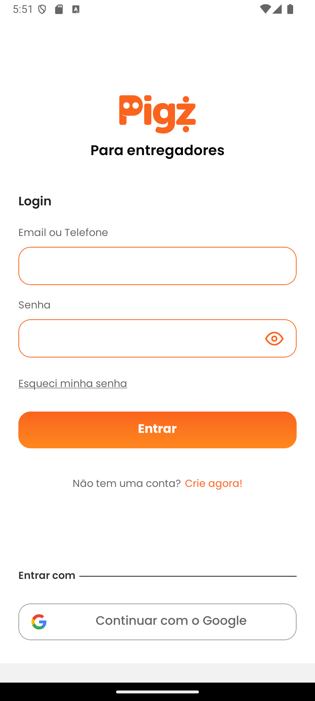
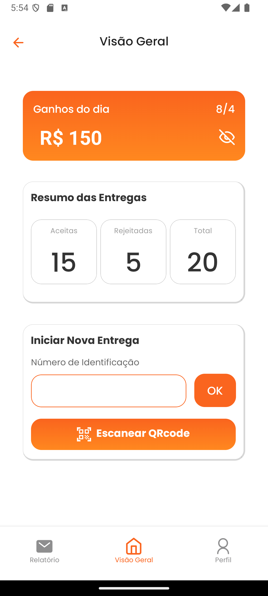
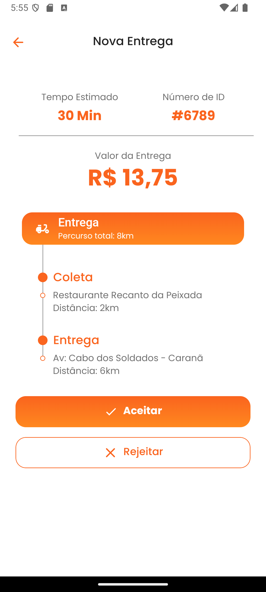

# 📦 Desafio Frontend Mobile - Pigz

Este projeto foi desenvolvido como parte do processo seletivo para a vaga de **Desenvolvedor Frontend Mobile na Pigz**. O desafio consistia em construir uma aplicação mobile para entregadores, com foco em Android, utilizando **React Native**.

---

## ✨ Funcionalidades

- Tela de Login com autenticação visual
- Dashboard com resumo de ganhos e entregas
- Acompanhamento de entrega
- Layout responsivo e seguindo o design da Pigz

---

## 🛠️ Tecnologias utilizadas

- [React Native](https://reactnative.dev/)
- [Expo](https://expo.dev/)
- [TypeScript](https://www.typescriptlang.org/)
- [React Navigation](https://reactnavigation.org/)
- [Expo Google Fonts](https://docs.expo.dev/guides/using-custom-fonts/)
- [React Native SVG](https://github.com/software-mansion/react-native-svg)
- [Expo Splash Screen](https://docs.expo.dev/versions/latest/sdk/splash-screen/)

---

## 📱 Layout

O layout utilizado foi fornecido pela Pigz via Adobe XD:  
[🔗 Link para o layout](https://xd.adobe.com/view/aa9d5857-660a-48ea-82e0-cf7766754949-ffce/specs/)

### 🔻 Tela de Login (preview)





---

## 🚀 Como executar o projeto

1. Clone o repositório:

```bash
git clone https://github.com/JassonJr1/desafio-frontend-mobile-pigz.git
```

2. Instale as dependências:

```bash
npm install
```

3. Inicie o projeto com o Expo:

```bash
npx expo start
```

> O app será aberto no navegador. Você pode testá-lo com o app Expo Go (no celular) ou emulador Android/iOS.

---
